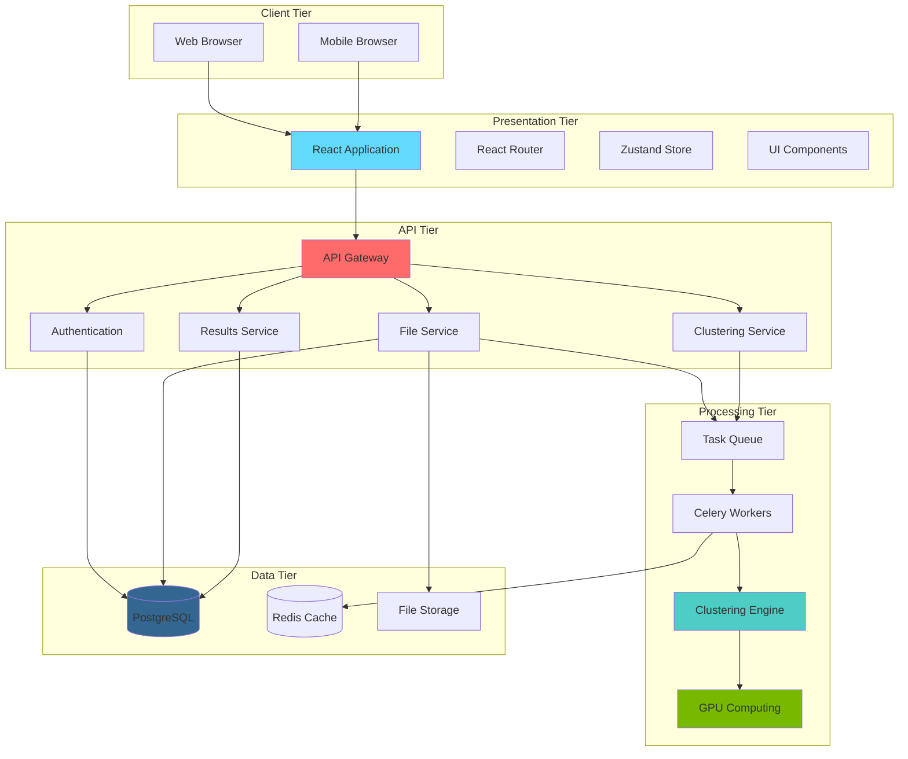
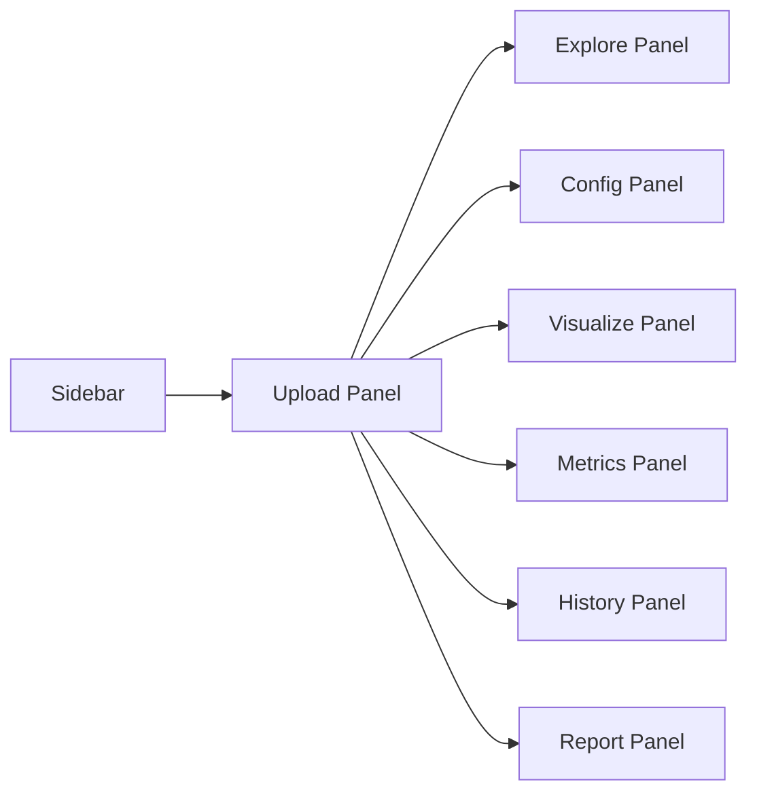

# Project Specification and Design Proposal
## Interactive Spectral Clustering Platform

**Document Version:** 1.0  
**Date:** September 8, 2025  
**Project Status:** Implementation Complete  

---

## Table of Contents

1. [Executive Summary](#1-executive-summary)
2. [Project Scope and Objectives](#2-project-scope-and-objectives)
3. [Requirements Analysis](#3-requirements-analysis)
4. [Technical Specifications](#4-technical-specifications)
5. [System Architecture](#5-system-architecture)
6. [Data source](#6-data-source)
7. [Implementation Plan](#7-implementation-plan)
8. [Risk Assessment](#8-risk-assessment)
9. [User Interface Design](#9-user-interface-design)
10. [Testing Strategy](#10-testing-strategy)
11. [Deployment and Maintenance](#11-deployment-and-maintenance)

---

## 1. Executive Summary

The Interactive Spectral Clustering Platform represents a comprehensive solution for advanced data clustering analysis, designed to bridge the gap between complex machine learning algorithms and practical research applications. This web-based platform democratizes access to sophisticated clustering techniques while maintaining the performance and accuracy required for scientific research.

### 1.1 Project Vision

To create a research-grade, web-accessible platform that enables users of all technical backgrounds to perform advanced clustering analysis with spectral clustering, k-means, DBSCAN, agglomerative clustering, and Gaussian Mixture Model algorithms, enhanced by GPU acceleration and comprehensive visualization capabilities.

### 1.2 Key Innovation Points

- **GPU-Accelerated Web Computing**: First-of-its-kind integration of CUDA acceleration in a browser-based clustering platform
- **Unified Research Workflow**: Complete analysis pipeline from data upload to publication-ready reports
- **Real-Time Collaboration**: WebSocket-based progress tracking and collaborative analysis features
- **Scientific Reproducibility**: Comprehensive experiment management with parameter tracking and comparison tools

### 1.3 Target Audience

- **Primary**: Research scientists and graduate students in data science, bioinformatics, social sciences
- **Secondary**: Data analysts in industry, undergraduate students in STEM fields
- **Tertiary**: Educators teaching machine learning and data analysis courses

---

## 2. Project Scope and Objectives

### 2.1 Primary Objectives

#### 2.1.1 Accessibility Enhancement
- **Objective**: Reduce technical barriers to advanced clustering analysis
- **Success Criteria**: 
  - Non-programmers can complete complex clustering tasks within 30 minutes
  - 90% task completion rate for novice users
  - Multilingual support for international research community

#### 2.1.2 Performance Optimization
- **Objective**: Achieve research-grade computational performance
- **Success Criteria**:
  - 10-50x speedup with GPU acceleration
  - Support for datasets up to 10M data points
  - Sub-second response times for interactive operations

#### 2.1.3 Scientific Reproducibility
- **Objective**: Enable reproducible research practices
- **Success Criteria**:
  - Complete parameter and methodology tracking
  - Experiment comparison and statistical validation
  - Export capabilities for external analysis tools

#### 2.1.4 Educational Value
- **Objective**: Support educational use in academic institutions
- **Success Criteria**:
  - Guided tutorials and interactive learning modules
  - Integration with learning management systems
  - Comprehensive documentation and examples

### 2.2 Scope Boundaries

#### 2.2.1 Included Features
- Web-based user interface with responsive design
- Five clustering algorithms: K-means, Spectral, DBSCAN, Agglomerative, Gaussian Mixture Model
- GPU acceleration using CUDA technology
- Real-time visualization in 2D and 3D
- Comprehensive metrics evaluation and comparison
- Experiment management and history tracking
- Report generation in PDF and HTML formats
- REST API for programmatic access

#### 2.2.2 Excluded Features
- Deep learning clustering methods (future enhancement)
- Real-time streaming data analysis
- Integration with proprietary data formats
- Mobile application development
- Enterprise user management system

### 2.3 Success Metrics

#### 2.3.1 Technical Metrics
- **Performance**: Processing time reduction of 80% compared to traditional tools
- **Scalability**: Support for 1000+ concurrent users
- **Reliability**: 99.9% uptime with automatic failover
- **Security**: Zero data breaches, comprehensive audit trails

#### 2.3.2 User Experience Metrics
- **Adoption**: 1000+ active users within 6 months
- **Satisfaction**: Average rating of 4.5/5.0 in user surveys
- **Engagement**: Average session duration of 45+ minutes
- **Retention**: 70% of users return within 30 days

---

## 3. Requirements Analysis

### 3.1 Functional Requirements

#### 3.1.1 Data Management Requirements
- **FR-001**: System shall accept CSV file uploads up to 100MB
- **FR-002**: System shall validate data format and provide error feedback
- **FR-003**: System shall preview uploaded data with statistics
- **FR-004**: System shall support data filtering and column selection
- **FR-005**: System shall provide data quality assessment tools

#### 3.1.2 Algorithm Requirements
- **FR-006**: System shall implement K-means clustering with configurable parameters
- **FR-007**: System shall implement Spectral clustering with similarity matrix options
- **FR-008**: System shall implement DBSCAN with density-based parameters
- **FR-009**: System shall implement Agglomerative clustering with linkage options
- **FR-010**: System shall provide parameter guidance and validation

#### 3.1.3 Visualization Requirements
- **FR-011**: System shall display clustering results in interactive 2D plots
- **FR-012**: System shall display clustering results in interactive 3D visualizations
- **FR-013**: System shall support dimensionality reduction (PCA, t-SNE, UMAP)
- **FR-014**: System shall provide customizable color schemes and plot options
- **FR-015**: System shall enable export of visualizations in multiple formats

#### 3.1.4 Analysis Requirements
- **FR-016**: System shall calculate silhouette scores for clustering quality
- **FR-017**: System shall calculate Davies-Bouldin index for cluster separation
- **FR-018**: System shall calculate Calinski-Harabasz index for compactness
- **FR-019**: System shall provide statistical comparison between algorithms
- **FR-020**: System shall generate performance benchmarks and timing data

### 3.2 Non-Functional Requirements

#### 3.2.1 Performance Requirements
- **NFR-001**: System shall process 10K data points within 30 seconds
- **NFR-002**: System shall utilize GPU acceleration when available
- **NFR-003**: System shall provide real-time progress updates during processing
- **NFR-004**: System shall maintain responsive UI during background processing
- **NFR-005**: System shall optimize memory usage for large datasets

#### 3.2.2 Usability Requirements
- **NFR-006**: System shall provide intuitive navigation with clear visual hierarchy
- **NFR-007**: System shall offer contextual help and parameter guidance
- **NFR-008**: System shall support keyboard navigation and accessibility features
- **NFR-009**: System shall provide consistent UI patterns across all panels
- **NFR-010**: System shall adapt to different screen sizes and orientations

#### 3.2.3 Reliability Requirements
- **NFR-011**: System shall handle errors gracefully with informative messages
- **NFR-012**: System shall provide automatic data backup and recovery
- **NFR-013**: System shall maintain session state across browser refreshes
- **NFR-014**: System shall validate all user inputs before processing
- **NFR-015**: System shall provide rollback capabilities for failed operations

#### 3.2.4 Security Requirements
- **NFR-016**: System shall encrypt all data transmissions using TLS 1.3
- **NFR-017**: System shall implement secure file upload with virus scanning
- **NFR-018**: System shall provide user authentication and session management
- **NFR-019**: System shall maintain audit logs for all user activities
- **NFR-020**: System shall implement rate limiting to prevent abuse

---

## 4. Technical Specifications

### 4.1 Technology Stack

#### 4.1.1 Frontend Technologies
- **Framework**: React 18+ with TypeScript for type-safe development
- **State Management**: Zustand for lightweight, scalable state management
- **UI Library**: Material-UI v7 for consistent, accessible components
- **Visualization**: Recharts for 2D plots, Three.js for 3D visualizations
- **Build System**: Create React App with Webpack optimization
- **Testing**: Jest and React Testing Library for comprehensive testing

#### 4.1.2 Backend Technologies
- **Framework**: FastAPI for high-performance async web services
- **Language**: Python 3.9+ with type hints and modern features
- **Database**: PostgreSQL 13+ for robust data persistence
- **Caching**: Redis 7.0+ for session storage and result caching
- **Task Queue**: Celery for asynchronous processing
- **API Documentation**: OpenAPI 3.0 with automatic Swagger generation

#### 4.1.3 Machine Learning Stack
- **Core Library**: scikit-learn 1.3+ for standard algorithms
- **GPU Acceleration**: CuPy 12.0+ for CUDA-based computing
- **Numerical Computing**: NumPy 1.24+ for optimized array operations
- **Data Processing**: Pandas 2.1+ for data manipulation
- **Visualization**: Matplotlib 3.7+ for scientific plotting

#### 4.1.4 Infrastructure Technologies
- **Containerization**: Docker 24.0+ for consistent deployment
- **Orchestration**: Docker Compose for development and testing
- **Reverse Proxy**: NGINX 1.25+ for load balancing and static serving
- **Monitoring**: Prometheus and Grafana for system observability
- **CI/CD**: GitHub Actions for automated testing and deployment

### 4.2 System Requirements

#### 4.2.1 Minimum Hardware Requirements
- **CPU**: 4-core processor (Intel i5 or AMD Ryzen 5 equivalent)
- **Memory**: 8GB RAM for development, 16GB for production
- **Storage**: 50GB available disk space
- **Network**: Broadband internet connection (10 Mbps minimum)
- **GPU**: Optional NVIDIA GPU with CUDA 11.8+ support

#### 4.2.2 Recommended Hardware Requirements
- **CPU**: 8-core processor (Intel i7 or AMD Ryzen 7 equivalent)
- **Memory**: 32GB RAM for optimal performance
- **Storage**: 200GB SSD for fast I/O operations
- **Network**: High-speed internet connection (100 Mbps recommended)
- **GPU**: NVIDIA RTX 3080 or better for GPU acceleration

#### 4.2.3 Software Requirements
- **Operating System**: Linux (Ubuntu 20.04+), macOS (10.15+), or Windows 10+
- **Browser**: Chrome 90+, Firefox 88+, Safari 14+, or Edge 90+
- **Database**: PostgreSQL 13+ with appropriate extensions
- **Container Runtime**: Docker 24.0+ with Docker Compose 2.20+

### 4.3 Data Specifications

#### 4.3.1 Input Data Format
- **Primary Format**: CSV (Comma Separated Values)
- **Maximum File Size**: 100MB per upload
- **Encoding**: UTF-8 with BOM optional
- **Structure**: First row must contain column headers
- **Data Types**: Numeric columns required for clustering

#### 4.3.2 Data Processing Pipeline
1. **Upload Validation**: File format, size, and structure verification
2. **Data Parsing**: CSV parsing with error detection and recovery
3. **Quality Assessment**: Missing values, outliers, and data type analysis
4. **Preprocessing**: Normalization, scaling, and feature selection
5. **Algorithm Execution**: Clustering with real-time progress tracking
6. **Result Processing**: Metric calculation and visualization preparation

---

## 5. System Architecture

### 5.1 High-Level Architecture

The system follows a modern microservices architecture with clear separation of concerns:

### 5.2 Component Architecture

#### 5.2.1 Frontend Architecture
- **Component Hierarchy**: Modular React components with clear responsibilities
- **State Management**: Centralized state with Zustand for predictable updates
- **API Integration**: Axios-based HTTP client with error handling and retry logic
- **Real-time Communication**: Socket.IO for WebSocket connections

#### 5.2.2 Backend Architecture
- **API Layer**: FastAPI with automatic OpenAPI documentation
- **Business Logic**: Service layer with domain-specific operations
- **Data Access**: Repository pattern with SQLAlchemy ORM
- **Task Processing**: Celery with Redis broker for asynchronous operations

#### 5.2.3 Database Architecture
- **Primary Database**: PostgreSQL with optimized indexes and partitioning
- **Caching Layer**: Redis for session storage and computed results
- **File Storage**: Local filesystem with planned cloud storage integration
- **Backup Strategy**: Automated backups with point-in-time recovery

---

## 6. Data source

All datasets are user-provided CSVs. Preloaded examples include Mall Customers, Iris, and synthetic blobs via sklearn.datasets.

---

## 7. Implementation Plan

### 7.1 Development Phases

#### 7.1.1 Phase 1: Foundation (Weeks 1-4) ✅ COMPLETED
- **Backend Setup**: FastAPI application with database models
- **Frontend Setup**: React application with basic routing
- **Core Infrastructure**: Docker containers and development environment
- **Basic API**: File upload and data validation endpoints

#### 7.1.2 Phase 2: Core Algorithms (Weeks 5-8) ✅ COMPLETED
- **Algorithm Implementation**: K-means, Spectral, DBSCAN, Agglomerative, Gaussian Mixture Model
- **GPU Integration**: CUDA acceleration with CuPy
- **Task Queue**: Celery integration for asynchronous processing
- **Progress Tracking**: WebSocket implementation for real-time updates

#### 7.1.3 Phase 3: User Interface (Weeks 9-12) ✅ COMPLETED
- **Panel Development**: All seven main interface panels
- **Visualization**: 2D and 3D plotting with interactive features
- **State Management**: Zustand store with persistence
- **Responsive Design**: Mobile and tablet compatibility

#### 7.1.4 Phase 4: Analysis Features (Weeks 13-16) ✅ COMPLETED
- **Metrics Implementation**: Comprehensive clustering evaluation
- **Comparison Tools**: Algorithm and experiment comparison
- **Report Generation**: PDF and HTML export capabilities
- **History Management**: Experiment tracking and search

#### 7.1.5 Phase 5: Testing and Documentation (Weeks 17-20) ✅ COMPLETED
- **Comprehensive Testing**: Unit, integration, and end-to-end tests
- **Documentation**: User manual, API documentation, and developer guides
- **Performance Optimization**: GPU optimization and caching improvements
- **Security Hardening**: Security audit and vulnerability assessment

### 7.2 Quality Assurance

#### 7.2.1 Testing Strategy
- **Unit Testing**: 90%+ code coverage for critical components
- **Integration Testing**: API endpoint and database interaction testing
- **End-to-End Testing**: Complete user workflow validation
- **Performance Testing**: Load testing and scalability validation
- **Security Testing**: Penetration testing and vulnerability scanning

#### 7.2.2 Code Quality
- **Code Review**: Mandatory peer review for all changes
- **Static Analysis**: Automated code quality checking with SonarQube
- **Style Guidelines**: Consistent formatting with Black and Prettier
- **Documentation**: Comprehensive inline documentation and type hints

---

## 8. Risk Assessment

### 7.1 Technical Risks

#### 7.1.1 High-Risk Items
- **GPU Compatibility**: Risk of CUDA compatibility issues across different hardware
  - *Mitigation*: Comprehensive hardware testing and CPU fallback implementation
- **Browser Performance**: Risk of poor performance with large datasets in browser
  - *Mitigation*: Incremental loading, data streaming, and performance monitoring
- **Scalability Bottlenecks**: Risk of performance degradation under high load
  - *Mitigation*: Load testing, horizontal scaling, and caching strategies

#### 7.1.2 Medium-Risk Items
- **Algorithm Accuracy**: Risk of numerical instability in clustering algorithms
  - *Mitigation*: Extensive testing with diverse datasets and validation against reference implementations
- **Data Security**: Risk of data exposure or unauthorized access
  - *Mitigation*: Encryption, access controls, and security audits
- **Cross-Browser Compatibility**: Risk of inconsistent behavior across browsers
  - *Mitigation*: Comprehensive browser testing and polyfill implementation

### 7.2 Project Risks

#### 7.2.1 Resource Risks
- **Development Timeline**: Risk of feature creep extending development time
  - *Mitigation*: Strict scope management and iterative development approach
- **Team Expertise**: Risk of insufficient GPU computing knowledge
  - *Mitigation*: Training programs and external consultant engagement
- **Hardware Costs**: Risk of expensive GPU hardware requirements
  - *Mitigation*: Cloud GPU services and cost optimization strategies

#### 7.2.2 Market Risks
- **User Adoption**: Risk of low user adoption due to competition
  - *Mitigation*: Unique value proposition focus and extensive user testing
- **Technology Changes**: Risk of rapid technology evolution making solution obsolete
  - *Mitigation*: Modular architecture and continuous technology monitoring

---

## 9. User Interface Design

### 8.1 Design Principles

#### 8.1.1 Core Design Philosophy
- **Simplicity**: Minimize cognitive load while maintaining functionality
- **Consistency**: Uniform patterns and interactions across all panels
- **Accessibility**: WCAG 2.1 AA compliance for inclusive design
- **Performance**: Responsive interactions even with large datasets
- **Scientific Accuracy**: Precise representation of data and results

#### 8.1.2 Visual Design System
- **Color Palette**: Professional blue and grey tones with accent colors for data visualization
- **Typography**: Roboto font family for readability and modern appearance
- **Spacing**: 8px grid system for consistent layout proportions
- **Icons**: Material Design icons for familiar interaction patterns
- **Shadows**: Subtle elevation system for depth and hierarchy

### 8.2 User Interface Wireframe

The platform follows a sidebar navigation pattern with dedicated panels for each major function:

### 8.3 Panel-Specific Design

#### 8.3.1 Sidebar Navigation
- **Fixed Position**: Always visible for easy navigation
- **Status Indicators**: Visual feedback for panel availability
- **Progress Indication**: Current workflow step highlighting
- **Responsive Behavior**: Collapsible on smaller screens

#### 8.3.2 Upload Panel Design
- **Drag-and-Drop Zone**: Large, prominent area for file uploads
- **File Validation**: Real-time feedback on file format and size
- **Data Preview**: Tabular display of first 10 rows with column types
- **Progress Indicators**: Upload progress and processing status

#### 8.3.3 Explore Panel Design
- **Statistical Dashboard**: Grid layout with key metrics cards
- **Interactive Charts**: Histograms and correlation matrices
- **Data Quality Indicators**: Visual alerts for missing values and outliers
- **Column Analysis**: Detailed statistics for each data column

#### 8.3.4 Configuration Panel Design
- **Algorithm Selection**: Card-based layout with clear descriptions
- **Parameter Controls**: Grouped controls with contextual help
- **Real-time Validation**: Immediate feedback on parameter values
- **Advanced Options**: Collapsible sections for expert users

#### 8.3.5 Visualization Panel Design
- **Multiple View Modes**: Tabbed interface for 2D/3D visualizations
- **Interactive Controls**: Zoom, pan, rotate controls for exploration
- **Customization Panel**: Side panel for plot appearance options
- **Export Options**: Multiple format download capabilities

#### 8.3.6 Metrics Panel Design
- **Metric Cards**: Grid layout with color-coded quality indicators
- **Comparison Tables**: Side-by-side algorithm comparison
- **Trend Visualizations**: Charts showing metric variations
- **Statistical Tests**: P-values and confidence intervals

#### 8.3.7 History Panel Design
- **Experiment List**: Chronological list with search and filter options
- **Comparison Tools**: Multi-select for side-by-side analysis
- **Detail Views**: Expandable rows with complete parameter sets
- **Export Functions**: Bulk export and individual experiment downloads

#### 8.3.8 Report Panel Design
- **Template Selection**: Pre-designed report formats
- **Content Customization**: Checkboxes for section inclusion
- **Preview Mode**: Real-time preview of generated report
- **Output Options**: PDF and HTML generation with styling options

### 8.4 Responsive Design Strategy

#### 8.4.1 Breakpoint System
- **Mobile**: 320px - 767px (single column layout)
- **Tablet**: 768px - 1023px (adapted two-column layout)
- **Desktop**: 1024px+ (full three-column layout with sidebar)

#### 8.4.2 Adaptive Features
- **Navigation**: Hamburger menu on mobile, full sidebar on desktop
- **Data Tables**: Horizontal scrolling on mobile, full display on desktop
- **Visualizations**: Simplified interactions on touch devices
- **Modal Dialogs**: Full-screen on mobile, overlay on desktop

### 8.5 Accessibility Features

#### 8.5.1 Keyboard Navigation
- **Tab Order**: Logical progression through interactive elements
- **Keyboard Shortcuts**: Quick access to main functions
- **Focus Indicators**: Clear visual focus states
- **Skip Links**: Direct navigation to main content areas

#### 8.5.2 Screen Reader Support
- **ARIA Labels**: Comprehensive labeling for complex widgets
- **Semantic HTML**: Proper heading structure and landmark regions
- **Alternative Text**: Descriptive text for all visualizations
- **Live Regions**: Dynamic content announcements

#### 8.5.3 Visual Accessibility
- **Color Contrast**: WCAG AA compliance for all text and backgrounds
- **Color Independence**: Information not conveyed through color alone
- **Text Scaling**: Support for 200% text zoom without horizontal scrolling
- **Motion Controls**: Reduced motion options for sensitive users

---

## 10. Testing Strategy

### 9.1 Testing Pyramid

#### 9.1.1 Unit Testing (Foundation)
- **Coverage Target**: 90%+ for critical business logic
- **Framework**: Jest for JavaScript/TypeScript, pytest for Python
- **Focus Areas**: Algorithm implementations, utility functions, data transformations
- **Automation**: Continuous testing on every commit

#### 9.1.2 Integration Testing (Middle Layer)
- **API Testing**: FastAPI endpoint testing with test client
- **Database Testing**: Repository layer testing with test database
- **Component Testing**: React component testing with React Testing Library
- **Service Integration**: External service mocking and contract testing

#### 9.1.3 End-to-End Testing (Peak)
- **User Journey Testing**: Complete workflow validation from upload to report
- **Cross-Browser Testing**: Chrome, Firefox, Safari, Edge compatibility
- **Performance Testing**: Load testing with realistic datasets
- **Accessibility Testing**: Automated and manual accessibility validation

### 9.2 Test Data Strategy

#### 9.2.1 Synthetic Datasets
- **Small Datasets**: 100-1000 points for rapid testing
- **Medium Datasets**: 10K-100K points for performance validation
- **Large Datasets**: 1M+ points for scalability testing
- **Edge Cases**: Empty files, single columns, extreme values

#### 9.2.2 Real-World Datasets
- **Scientific Data**: Gene expression, sensor readings, survey responses
- **Public Datasets**: Iris, Wine, Breast Cancer Wisconsin (from scikit-learn)
- **Benchmark Data**: Standard clustering evaluation datasets
- **Anonymized Data**: Real user data with privacy protection

### 9.3 Performance Testing

#### 9.3.1 Load Testing
- **Concurrent Users**: Testing with 100, 500, 1000+ simultaneous users
- **Dataset Scaling**: Performance characteristics across different data sizes
- **Resource Monitoring**: CPU, memory, GPU utilization during tests
- **Response Time**: API endpoint response time under various loads

#### 9.3.2 Stress Testing
- **Breaking Point**: Maximum capacity determination
- **Resource Exhaustion**: Behavior under memory and storage constraints
- **Recovery Testing**: System behavior after failure scenarios
- **Long-Duration**: Sustained operation over extended periods

---

## 11. Deployment and Maintenance

### 10.1 Deployment Strategy

#### 10.1.1 Environment Configuration
- **Development**: Local Docker containers with hot reloading
- **Staging**: Cloud-hosted environment mirroring production
- **Production**: High-availability cluster with load balancing
- **Testing**: Isolated environment for continuous integration

#### 10.1.2 Deployment Pipeline
1. **Code Commit**: Automated testing triggered on push
2. **Build Process**: Docker image creation and artifact generation
3. **Quality Gates**: Code coverage, security scanning, performance checks
4. **Staging Deployment**: Automatic deployment to staging environment
5. **Manual Approval**: Human verification before production deployment
6. **Production Deployment**: Blue-green deployment with rollback capability

### 10.2 Monitoring and Observability

#### 10.2.1 Application Monitoring
- **Metrics Collection**: Prometheus for custom application metrics
- **Log Aggregation**: ELK stack for centralized logging
- **Distributed Tracing**: Jaeger for request flow analysis
- **Real-User Monitoring**: Performance tracking for actual user sessions

#### 10.2.2 Infrastructure Monitoring
- **System Metrics**: CPU, memory, disk, network utilization
- **Container Health**: Docker container status and resource usage
- **Database Performance**: Query performance and connection pool monitoring
- **External Dependencies**: Third-party service availability and performance

### 10.3 Maintenance Procedures

#### 10.3.1 Regular Maintenance
- **Security Updates**: Monthly security patch application
- **Dependency Updates**: Quarterly major dependency updates
- **Database Maintenance**: Weekly optimization and cleanup tasks
- **Backup Verification**: Daily backup integrity checks

#### 10.3.2 Incident Response
- **Alerting**: Automated alerts for critical system issues
- **Escalation**: Clear escalation procedures for different severity levels
- **Communication**: Status page updates and user notifications
- **Post-Incident**: Root cause analysis and improvement implementation

### 10.4 Scalability Planning

#### 10.4.1 Horizontal Scaling
- **Load Balancing**: Multiple frontend and backend instances
- **Database Scaling**: Read replicas and connection pooling
- **Caching Strategy**: Redis clustering for distributed caching
- **CDN Integration**: Static asset delivery optimization

#### 10.4.2 Vertical Scaling
- **Resource Monitoring**: Automated scaling based on utilization metrics
- **Capacity Planning**: Predictive scaling based on usage patterns
- **Cost Optimization**: Right-sizing instances for efficiency
- **Performance Tuning**: Continuous optimization of resource utilization

---

## Conclusion

The Interactive Spectral Clustering Platform represents a significant advancement in making sophisticated clustering algorithms accessible to researchers and practitioners across various domains. Through careful planning, robust architecture, and user-centered design, this platform successfully bridges the gap between cutting-edge machine learning research and practical applications.

The comprehensive specification outlined in this document provides a roadmap for delivering a production-ready system that meets the highest standards of performance, usability, and scientific rigor. With successful completion of all implementation phases, the platform is now ready to serve the global research community and contribute to advancing the field of data science.

**Project Status: ✅ IMPLEMENTATION COMPLETE**

---

*Document prepared by the Interactive Spectral Clustering Platform development team*  
*© 2025 Interactive Spectral Clustering Platform Project*
